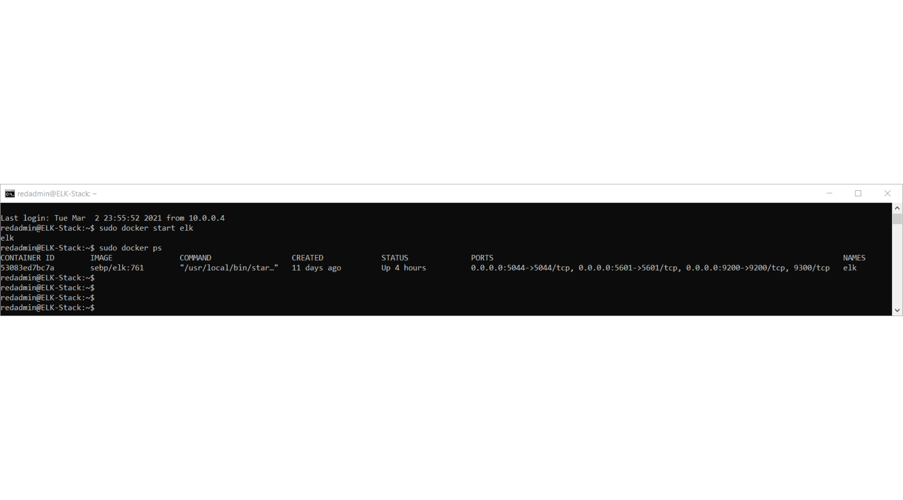

## Automated ELK Stack Deployment

The files in this repository were used to configure the network depicted below.

These files have been tested and used to generate a live ELK deployment on Azure. They can be used to either recreate the entire deployment pictured above. Alternatively, select portions of the _____ file may be used to install only certain pieces of it, such as Filebeat.

  -     - 
  
  -   

This document contains the following details:
- Description of the Topologu
- Access Policies
- ELK Configuration
  - Beats in Use
  - Machines Being Monitored
- How to Use the Ansible Build

### Description of the Topology

The main purpose of this network is to expose a load-balanced and monitored instance of DVWA, the D*mn Vulnerable Web Application.

Load balancing ensures that the application will be highly available, in addition to restricting access to the network.
- _TODO: What aspect of security do load balancers protect? What is the advantage of a jump box?_ Load balancing ensures that the application will be highly available, in addition to restricting access to the network.  Load Balancing contributes to the Availability aspect of security in regards to the CIA Triad.

- The advantage of a JumpBox is the orgination point for launching Administrative Tasks. This ultimately sets the JumpBox as a Secure Admin Workstation). All Administrators when conducting any management Tasks will be required to connect to the JumpBox.  The Jumpbox is configured for restrictive access providing a more secure environment.

Integrating an ELK server allows users to easily monitor the vulnerable VMs for changes to the filesystm and system resources.
-  Filebeat watches for log files or locations that are configured, collecting log events and fowards them to Elasticsearch or Logstash for indexing
-  Metricbeat records metric and statistical data from the operating system and from the services running on the host servers.

The configuration details of each machine may be found below.
 
| Name                 | Function    | IP Address             | Operating System   |
|----------------------|-------------|------------------------|--------------------|
| Jump-Box-Provisioner | Ansible     | 40.114.71.170 10.0.0.4 | Linux Ubuntu 18.04 |
| Red-Web-1            | Docker-DVWA | 10.0.0.6               | Linux Ubuntu 18.04 |
| Red-Web-2            | Docker-DVWA | 10.0.0.7               | Linux Ubuntu 18.04 |
| ELK                  | ELK Stack   | 52.251.46.88 10.1.0.4  | Linux Ubuntu 18.04 |

### Access Policies

The machines on the internal network are not exposed to the public Internet.

Only the Jump-Box machine can accept connections from the Internet. Access to this machine is only allowed from the following IP addresses:
- whitelisted IP address:  Admins personal IP address
 Machines within the network can only be accessed via SSH.
-  Which machine did you allow to access your ELK VM? What was its IP address?_ Jump-Box-Provisioner 10.0.0.4

A summary of the access policies in place can be found in the table below.

| Name                 | Publicly Accessible | Allowed IP Addresses   |
|----------------------|---------------------|------------------------|
| Jump-Box-Provisioner | Yes                 | Personal IP            |
| Red-Web-1            | No                  | 10.0.0.4               |
| Red-Web-2            | No                  | 10.0.0.4               |
| ELK-Stack            | Yes                 | 40.114.71.170 10.0.0.4 |

### Elk Configuration

Ansible was used to automate configuration of the ELK machine. No configuration was performed manually.
 
-  The main advantage that Anisble brings is automation of and simpliplification of repetative, complex, and tedious operations a systems admin.

-The playbook implements the following tasks:
- ...
- ...
-   Install: docker.io
-   Install python-pip
-   Install  docker module
-   Increase Memory Use: sysctl -w vm.max_map_count=262144
-   Download and Launch a docker elk container

The following screenshot displays the result of running `docker ps` after successfully configuring the ELK instance.

### Target Machines & Beats
This ELK server is configured to monitor the following machines:
 
- We have installed the following Beats on these machines: Red-Web-1 10.0.0.7 Red-Web-2 10.0.0.6

- Filebeat and Metricbeat

These Beats allow us to collect the following information from each machine:
 
-   Filebeat is a lightweight shipper for forwarding and centralizing log data. Filebeat monitors log files or locations you specify, collects log events, and forwards them either to Elasticsearch or Logstash for indexing.

-   Metricbeat collects metrics from the operating system and from services running on the server. Metricbeat then takes the metrics and statistics that it collects and ships them to the output that you specify.

### Using the Playbook
In order to use the playbook, you will need to have an Ansible control node already configured. Assuming you have such a control node provisioned:

SSH into the control node and follow the steps below:
- Copy the _____ file to _____.
- Update the _____ file to include...
- Run the playbook, and navigate to ____ to check that the installation worked as expected.

_TODO: Answer the following questions to fill in the blanks:_
- _Which file is the playbook? Where do you copy it?_
-  Copy the filebeat.yml file to the /etc/ansible/roles/files/ directory.

- _Which file do you update to make Ansible run the playbook on a specific machine? How do I specify which machine to install the ELK server on versus which to install Filebeat on?_
-  Update the configuration file to include the Private IP of the Elk-Server to the ElasticSearch and Kibana sections of the configuration file.
-  Create a new playbook in the /etc/ansible/roles/ directory that will install, drop in the updated configuration file, enable and configure system module, run the filebeat setup, and start the filebeat service.

- _Which URL do you navigate to in order to check that the ELK server is running?
- http://[your.VM.IP]:5601/app/kibana.

_As a **Bonus**, provide the specific commands the user will need to run to download the playbook, update the files, etc._
 The commands needed to run the Ansible configuration for the Elk-Server are:
- ssh RedAdmin@JumpBox(PrivateIP)
- sudo docker container list -a (locate your ansible container)
- sudo docker start container (name of the container)
- sudo docker attach container (name of the container)
- cd /etc/ansible/
- ansible-playbook elk.yml (configures Elk-Server and starts the Elk container on the Elk-Server) wait a couple minutes for the implementation of the Elk-Server
- cd /etc/ansible/roles/
- ansible-playbook filebeat-playbook.yml (installs Filebeat and Metricbeat)
- open a new web browser (Elk-Server 10.1.0.4:5601) This will bring up the Kibana Web Portal 
